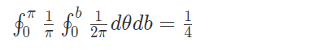

**机器学习&nlp面试题**

https://www.nowcoder.com/discuss/231656

<https://www.nowcoder.com/discuss/258321?type=2> 

**1、gbdt和xgb**   

   (gbdt、xgb、lgb凡是项目提到了一定要熟练掌握)  

   **2、BN、Dropout**   

   (Dropout可以作为训练深度神经网络的一种trick供选择。在每个训练批次中，通过忽略一半的特征检测器（让一半的隐层节点值为0，当然这个“一半”是超参数，自己设），可以明显地减少过拟合现象。这种方式可以减少特征检测器（隐层节点）间的相互作用，检测器相互作用是指某些检测器依赖其他检测器才能发挥作用。    

   Dropout说的简单一点就是：我们在前向传播的时候，让某个神经元的激活值以一定的概率p停止工作，这样可以使模型泛化性更强，因为它不会太依赖某些局部的特征。   

   其实就是个Bagging策略，构造子网组合。)  

​      

   **3、为什么不用先用LR呀（LR这么简单用它干嘛？）**   

   用LR做做二分类，做做stack还是挺好的，但LR总感觉表达能力不够，特征比较粗的话效果可能一般。  

   (后来觉得LR还挺厉害的，详情可以见总结的一些基础机器学习知识那里，LR可解释性、速度都很快，还是凸优化，用来衡量特征做得好不好还是可以的)

**5、AUC知道吧，回归怎么计算AUC**

不知道怎么计算，一查 根本没有..是不是我听错了 他其实想说逻辑回归的AUC怎么计算

 

**2、LR用过吗？**   

   必须的  

   **3、LGB比XGB好的点？**   

   直接介绍二者不同  

   **4、L1、L2不同？L1为什么能稀疏？**   

   从数学分布讲了，一个是拉普拉斯分布 一个是高斯分布；讲了图解为什么L1能稀疏，一个圈一个菱形，容易交在轴上。工程上讲了，L1的近似求导，区间内0区间外优化。然后L2是直接求导比较简单。  

   **5、哪些学习器是凸优的呀？**   

   LR sigmoid logloss 凸优 。线性回归，最小二乘凸优。SVM凸优。NN肯定不凸优，因为往往收敛到鞍点。PCA无数学解，但是利用特征值去做反而得到最优解。  

   (注意sigmoid+平方损失不是凸优化)  

   **6、特征重要性你怎么做，例如特征组合和删除，调参你是怎么调的呀？**   

   答：特征组合用onehot、交叉、EMBEDING。组合的话要看实际分布，讲了自己构造过的一个和标签有线性关系的组合，说自己用的是遍历的方法，用两两数学关系构造新特征，看和标签的线性关系。  

   特征删除等想到了某个KAGGLE大佬的特征筛选步骤，从他的kernel我也是学到了很多。  

   调参：  

   第一步祖传参数。比如树模型的深度、采样频率等，这个主要还是经验  

   第二部调参，比如尝试新特征，特征采样频率要设为1啊这种细节  

   **7、知道几种激活函数？**   

   我说最简单的SIGMOID TANH RELU我就不提了，讲了讲某个比赛时候用到了leakRELU，然后谷歌的论文里面的swish函数，随口介绍了一下这个论文。  

   **8、鞍点是什么？**   

   我嘴贱说这个干吗，然后我说忘了，但绝对不是局部最优点，看表情面试官可以满意，其实真忘了。  

   (结合鞍点图像理解更佳。注意鞍点在一个方向上升，所以很容易坐滑滑梯从上方滑到鞍点。另一个方向是下降，所以可以坐着下降的滑滑梯下去，但是鞍点这里梯度是0，是平的，所以优化就容易困在这里。前面多走几步就是滑滑梯但是他无路可走。  

   百度百科的的解释：  

   鞍点（Saddle point）在微分方程中，沿着某一方向是稳定的，另一条方向是不稳定的奇点，叫做鞍点。在泛函中，既不是极大值点也不是极小值点的  

   临界点，叫做鞍点。在矩阵中，一个数在所在行中是最大值，在所在列中是最小值，则被称为鞍点。在物理上要广泛一些，指在一个方向是极大值，另一个方向是极小值的点。  

   广义而说，一个光滑函数（曲线，曲面，或超曲面）的鞍点邻域的曲线，曲面，或超曲面，都位于这点的切线的不同边。)  

   **先问用没用过RNN**   

   答：项目的RNN效果，分析RNN在项目里不好，和比赛中RNN前期效果（前期效果最好）  

   **用过GRU吗，为什么LSTM能够记忆长时记忆。**   

   答：GRU用过一次，在哪里用的。用的记忆门，保证长时记忆传输。  

   **9、Attention有哪些？**   

   答：之前说到了自己用过attention，只用过，不知道原理。  

   (作为一个调参侠，各种网络随便试，但是attention的本质我还是不甚理解，attention is all you need？)  

   **10、Dropout为什么预防过拟合？**   

   从bagging的角度答的，NN是偏差小方差大的学习器，适合用bagging，构造子网络在预测的时候组合，相当于构造了学习的多样性，实现了bagging。  

   **11、协同过滤：**   

   说了解 但是没写过代码  

   (协同过滤，感觉一个学生要是搞科研为主还是很难接触到，感兴趣的可以了解下，特别是面电商的商品推荐工程师呀还是容易问到的)  

   **12、CTR估计，都用什么？**   

   我说LR和FM ，代码写过，FM主要是NFM，其他的FM都知道理论但是没写过代码

**3、LGB和XGB区别**   

   一开始听错了以为是LSTM，我还在想LSTM和XGB的区别，这怎么说，先介绍介绍XGB吧，然后说完XGB反应过来，面试官不是让我说LGB吧。。那就好说了，一顿讲。   

   (答案前面有)  

   **4、介绍CNN、卷积层如何实现非线性**   

   使用激活层，不然在卷积都是线性变换。我从猫的视觉锥细胞开始一顿讲，应该讲的挺详细了，CNN的时不变性真的很适合用于信号处理。讲了时不变和局部权值共享，说CNN是DNN的特例。   

   (  

   卷积：对图像（不同的数据窗口数据）和滤波矩阵（一组固定的权重）做内积操作。   

   卷积的重要的物理意义是：一个函数（如：单位响应）在另一个函数（如：输入信号）上的加权叠加。   

   卷积神经网络CNN是多层感知机(MLP)的变种。20世纪60年代，Hubel等在研究猫脑皮层时发现其独特的网络结构可以有效地降低反馈神经网络的复杂性，继而提出了CNN。   

   CNN：局部连接和共享权值的方式，减少了的权值的数量使得网络易于优化，另一方面降低了过拟合的风险。该优点在网络的输入是***图像时表现的更为明显，使图像可以直接作为网络的输入，避免了传统识别算法中复杂的特征提取和数据重建过程。在二维图像处理上有众多优势。   

   CNN具有一些传统技术所没有的优点：良好的容错能力、并行处理能力和自学习能力，可处理环境信息复杂，背景知识不清楚，推理规则不明确情况下的问题，允许样品有较大的缺损、畸变，运行速度快，自适应性能好，具有较高的分辨率。它是通过结构重组和减少权值将特征抽取功能融合进多层感知器，省略识别前复杂的图像特征抽取过程。   

   CNN的泛化能力要显著优于其它方法，卷积神经网络已被应用于模式分类，物体检测和物体识别等方面。利用卷积神经网络建立模式分类器，将卷积神经网络作为通用的模式分类器，直接用于灰度图像。   

   )  

   **5、卷积层 pooling层怎么放？激活层放哪里比较好，有什么区别？**   

   没听明白，不该是中间夹一个激活层吗。面试官的pooling口音真的是一言难尽呀？我一直以为说的是最后的全连接FC层，我心想这不是被全局池化代替了么？不会所以一顿乱说？因为我自己也是改网络的时候，经常会尝试层的位置交换，我都是哪个效果好用哪个。讲的时候想起了何恺明大神的论文里的预激活，然后对着预激活、卷积层在Resnet的作用一顿夸。有会的大佬么。请私聊教教我。。。

**RF DT LGBM在特征选择的区别**   

   介绍了很多，从ID3讲到C4.5讲到CART讲到XGB讲到LGB，boost的从头讲到尾，RF详细说了，还讲了讲lgb的特征采样参数的坑，如何按叶分类。面试官补充问为什么学习率和树深度的关系？我感觉是树越深越小，但不确定，于是肯定的说(不能露怯)越深学习率可以越小。问LGB学习率可以比较小，LGB树深但是每层很瘦，巴拉巴拉讲了不少，顺便讲了一些自己觉得是玄学的网上给出的解释，因为讲的特别细还讲的很快，面试官极为满意。不过我不是百分百确定自己对于学习率那一段说的对不对。

**如何提高精准率呢？**   

   调分类阈值+大，但是召回率降低就回退。  

   正样本权重变高训练，用focalloss  

   **FocalLoss？**   

   简单介绍FocalLoss，何恺明大神用于检测任务的，就是正样本极低但是负样本很多的。但是我们这里负向本已经错了很多的，所以负样本下采样不行，但是上采样没必要，因为负样本太多用不完。  

   (Focal loss主要是为了解决one-stage目标检测中正负样本比例严重失衡的问题。该损失函数降低了大量简单负样本在训练中所占的权重，也可理解为一种困难样本挖掘。  

   作者认为one-stage和two-stage的表现差异主要原因是大量前景背景类别不平衡导致。作者设计了一个简单密集型网络RetinaNet来训练在保证速度的同时达到了精度最优。在双阶段算法中，在候选框阶段，通过得分和nms筛选过滤掉了大量的负样本，然后在分类回归阶段又固定了正负样本比例，或者通过OHEM在线困难挖掘使得前景和背景相对平衡。而one-stage阶段需要产生约100k的候选位置，虽然有类似的采样，但是训练仍然被大量负样本所主导。

   以上内容是百度的，作者就是何恺明大神啦，做CV的或者有兴趣的可以看一看。)  

   **如果不改动现有模型呢？**   

   我说一般我会用二分类trick，但是这种不知道在二分类行不行，应该不行吧，不如人工查。  

   面试官反馈说人工肯定要查的，(我已经意识到自己的上一句话不妥了，但是现在是对方的回合)，面试官说了人工查的重要性和必要性，然后说这一步提高精准率就是为了减少人力，然人从大量分类错的样本解放出来，可以用二分类，对分错的样本和负样本再二分类。我表示同意，说这个Trick不错。面试说，对啊，不就是个Trick么。

**2、分类和回归的差异是什么？**   

​    如果非要说本质区别，应该是输出变量是否是连续型变量。但我觉得本质区别是分类的结果没有大小之分但回归有，训练的时候分类使得各类别间隔最大但回归不可以，因此分类的训练结果往往会优于回归很多，这也是为什么坐标映射用分类做比较好的原因。   

​    **3、被逮到了 分类使得各类别间隔最大但回归不可以？问原因**   

​    我说看论文看到的，具体的忘了(没认真看不知道原因)   

​    **4、一定要给个解释，因为很多分类用回归做的，讲讲为什么分类使的间隔最大。**   

​    自己的理解。实际中分类往往是回归+切分阈值做分类。以GBDT为例，假设我们设树的数量是100的三分类任务，我们实际上做了300颗树，然后每一百颗树回归出一个输出维度的结果，(我们三分类是ABC，那么一般会先onehot成1 0 0,0 1 0,0 0 1。然后前100颗树拟合的是回归的1 0 0 中的1，这样。然后给出一个新样本，我们300颗树回归出三个结果 x y z，再套用softmax公式得出最终的结果。注意到softmax求导是这样的，如果输出特征维度j对应上和没对应上是两种情况，i=j怎么样，i!=j怎么样。因为输出值虽然是类别但是我们编码成了向量，因此有了第几个这个概念，i和j就有两种形式吗，但最终的结果就是如果当前是1，就会把当前维度的预测朝着1进行，其他维度朝着0进行，也就是不仅对本维度增强，也会对其他维度抑制，因此间隔变大。   

​    (不满意，让接着说)   

​    对于激活函数，以sigmoid为例，我们预测结果从0.5到0.9是容易预测的，0.9到0.99是不容易预测的。(打断，让解释原因再接着说)，sigmoid可以认为包含了中间的线性区和两端的饱和区，对线性区求导接近1但是饱和区就是很小很小的小数，因此两端梯度几乎不更新，0.9-0.99这一段梯度很小，但是0.5-0.9梯度很大，因此sigmoid预测的结果就是容易收敛到两端。over。对于我们的多分类任务，虽然是回归在做，但是我们onehot后就成了0 1 的向量，此时我们很容易得到趋近两端饱和区的结果而不是落在中间，但是回归的话数字是连续的分布在激活函数的各个部位，有的落在饱和区有的落在线性区，落在线性区就很容易抖动收敛的不好，而且回归有大小之分，就可能出现梯度的矛盾(前一段上升后一段又降了)，特别是回归的离群点，不好好处理的话容易对整体收敛进行较大的干扰(因为回归可以很大很大的值做干扰，比如回归范围1-1000W，但是绝大多数数据几种在10-20这样，很难对大数预测的准确)。总之，在优化这一步回归是很难的，但是用softmax做分类则可以。(个人观点)   

​    **5、二分类讲讲，和softmax区分开。**   

​    简单一提，顺势引入LR。   

​    **6、为什么交叉熵不用L2。**   

​    首先肯定了L2可用，但是不好用。用L2一样是可以求导的而且能够训练出结果。认为交叉熵有更多的好处，首先sigmoid函数是推导出来的，不能变的，在sigmoid函数的前提下，使用L2损失并不是一个凸优化的过程，而logloss则是凸优化的过程，当优化过程不是凸优化的时候，我们没法保证收敛到的局部最优解是全局最优的，所以用logloss我们能够保证至少虽然求得是局部最优解，但他就是全局最优解，是可用的。   

​    另外则是分布上，本质上学习器就是在拟合分布，使用logloss我们有更好的解释性，那就是我们就是在拟合最理想的分布，假设学习器理论上最好的分布式p(x)，其实就是我们的label，我们自己的分布式q(x)，则两个分布的差异可以用p(x)log(p(x))-p(x)log(q(x))来衡量，当特征做好了，q(x)固定了，我们对x求导，则只剩下右边交叉熵的部分，即logloss，我们就可以说，学习器在拟合最理想的分布。   

​    最后简单一提最大熵模型。   

​    **7、xgb介绍**   

​    完整大流程开讲，(打断，改讲一棵树的流程)按层分类，建一棵茂盛的树，遍历所有特征，当增益够大的时候，对此特征分裂成左右子树，因为基模型一般是CART回归树所以是二分裂，到达树深的限制后就成了一棵茂盛的矮壮的树。   

​    **8、达到树深才不切分吗？**   

​    不是，要父结点-左孩子-有孩子-L1正则-L2正则的增益>阈值才分类。 

 

**1、手写ID3**   

​    问我要多长时间，本来我想说20分钟的，他看我没说了给了半小时。   

​    有一个小点写错了，ID3是多叉树我写成二叉了。笑死了。我写成把数据切分成某特征某维和某特征其他维两种情况了，稍微改一改改成多叉就可以了，具体是遍历这个特征的所有取值，然后根据取值切分数据集成多份，递归向下就可以。。 。   

​    **2、给出一个完整的方案 电商推荐 包括样本 label选取、用哪些特征**   

​    说了很久很久。建议看看相关论文啥的了解了解。   

​    **你都学过什么？**   

​    **LR****回归的损失函数？**   

​    **损失函数怎么导啊？**   

​    口述了求导过程，先对sigmoid偏导*sigmoid对x偏导   

​    **GBDT****和****RF？**   

​    **GBDT****如何分类？**   

​    **GBDT****如何算梯度？**   

​    **过拟合如何解决？**   

​    **CNN****知道吗？**   

​             **FM知道吗？梯度怎么算？             空洞卷积知道吗？**        

​       

​    **注意力知道吗？**

 

**概率题：圆上三点锐角三角形概率**   

​    一个点一个点的考虑，先随便找一个点，由于对称性，第一个点随便放，就假设放在了最上面。第一个点就是常点。然后第二点左右对称，可以只考虑放左边，是个均匀分布。第三个点随便放，也是均匀分布，已放好的两个点分别过圆心连线并延长，延长线到圆的交点围成的扇形就是，积个分就可以了。尴尬的是结果是1/4而不是1/3和1/6这样的，至少凑个3啊。   

​    延长的时候会发现圆心延长是直径，对应角是90°。然后至于为什么是两直径中间的部分而不是外面的部分，没太多分析，感觉是中间的部分，画了画图。   

​       

​     最前沿paper复现并取得收益->其他部门负责复现。
 工作是通常意义算法工程师 参数的设置和接口的调用、选用等应用于自己的业务并负责业务的上线。
 代码的工作完全可见->利于成长,可以参与其他团队的设计，。